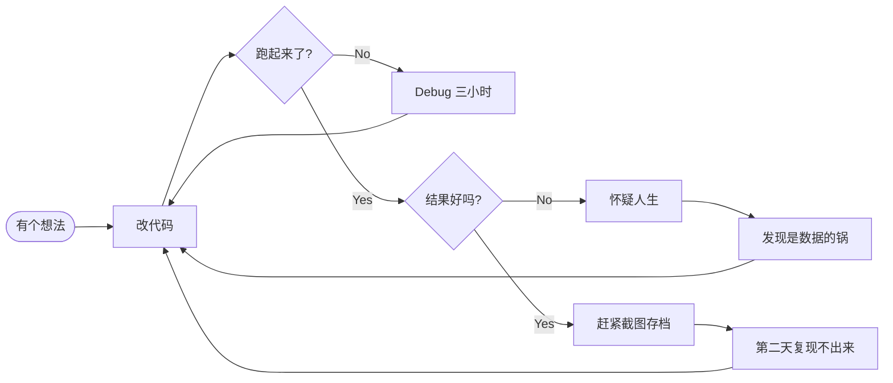

<div align="center">


<br/>


</div>

---

### 🧭 关于我

```yaml
name:      Ning Wang
location:  一台装着 RTX 5090 的机器旁边
doing:     医学图像融合 / 深度学习
learning:  怎么让模型听话
believes:  "结果不对的时候, 先怀疑数据"
mood:      不想科研了（暂时性的，大概）
```

- 🔬 主要在做 **医学图像融合**，最近折腾可控融合这条线
- 🌱 正在学怎么把「跑通了」变成「跑好了」
- 🎬 宫崎骏の信徒，《幽灵公主》看过不下十遍
- ☕ 咖啡驱动开发，Bug 驱动学习

---

### 🔁 我的实验日常



---

### 🛠 常用工具

<div align="center">

**炼丹**


**干活**


</div>

---

### 📈 一些不太科学的进度条

```text
PhD 进度        ███████░░░░░░░░░░░░░   35%   （慢慢来）
论文写作        ██░░░░░░░░░░░░░░░░░░   10%   （摘要写了三遍）
GPU 利用率      ███████████████████░   97%   （风扇在惨叫）
睡眠负债        ████████████████████  200%   （已破表）
咖啡因耐受度    ██████████████████░░   90%   （四杯起步）
"这次一定"      ████████████████████  ∞      （每周重置）
```

---

<details>
<summary><b>🐛 点开：Debug 的五个阶段</b></summary>

<br/>

| 阶段 | 内心活动 | 实际耗时 |
|:--:|---|:--:|
| 1️⃣ 否认 | "不可能，我这段代码明明是对的" | 5 分钟 |
| 2️⃣ 愤怒 | "这框架有 bug 吧？我要提 issue" | 20 分钟 |
| 3️⃣ 讨价还价 | "我就加个 print，就一个" | 2 小时 |
| 4️⃣ 沮丧 | "要不还是转行吧" | 30 分钟 |
| 5️⃣ 接受 | "……哦，我 shape 写反了" | 3 秒 |

</details>

<details>
<summary><b>💬 点开：我最常说的几句话</b></summary>

<br/>

> 「奇怪，昨天还好好的。」
>
> 「在我这儿能跑啊。」
>
> 「最后跑一次就睡。」——凌晨 1 点
>
> 「这个先记 TODO，之后再改。」——之后 = 永远
>
> 「我觉得是数据的问题。」——通常真的是

</details>

<details>
<summary><b>🎬 点开：反复看的几部片子</b></summary>

<br/>

- 🌲 **幽灵公主** — 山兽神走过的地方，草木枯荣。看一次哭一次
- 🏰 **天空之城** — "根要扎在土里，与风共生"
- 🛁 **千与千寻** — 名字被夺走的隐喻，越长大越懂
- 🐉 **哈尔的移动城堡** — 只是想要一个会走路的家

</details>

---

### 📊 一些数字

<div align="center">


<br/><br/>


<br/><br/>


</div>

---

### 🐍 贪吃蛇吃掉我的提交格子

<div align="center">

<picture>
  <source media="(prefers-color-scheme: dark)" srcset="https://raw.githubusercontent.com/ningwang849657/ningwang849657/output/snake-dark.svg" />
  <source media="(prefers-color-scheme: light)" srcset="https://raw.githubusercontent.com/ningwang849657/ningwang849657/output/snake.svg" />
  
</picture>

<sub>每天自动重新生成 · 格子越多蛇爬得越久</sub>

</div>

---

### 📉 贡献曲线

<div align="center">


</div>

---

### 🌌 今日一句

<div align="center">


</div>

---

<div align="center">

<i>「実験が通らないときは、まずデータを疑え。」</i>

<sub>实验跑不通的时候，先检查数据 —— 每一次都是这样，但每一次都最后才想起来</sub>

<br/><br/>


</div>
